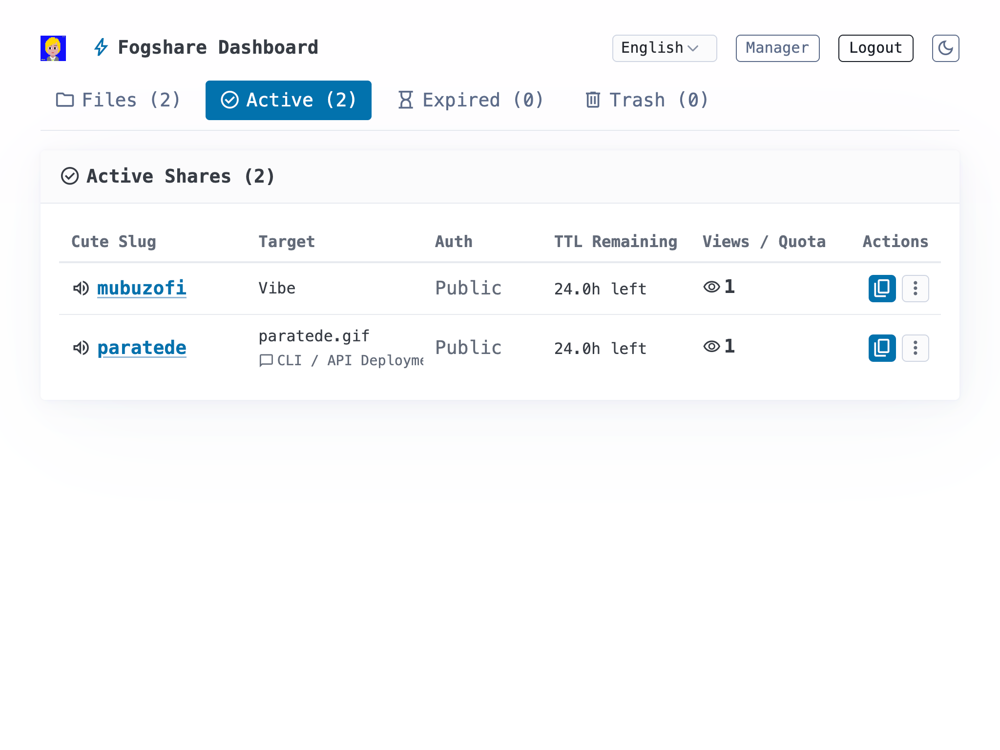
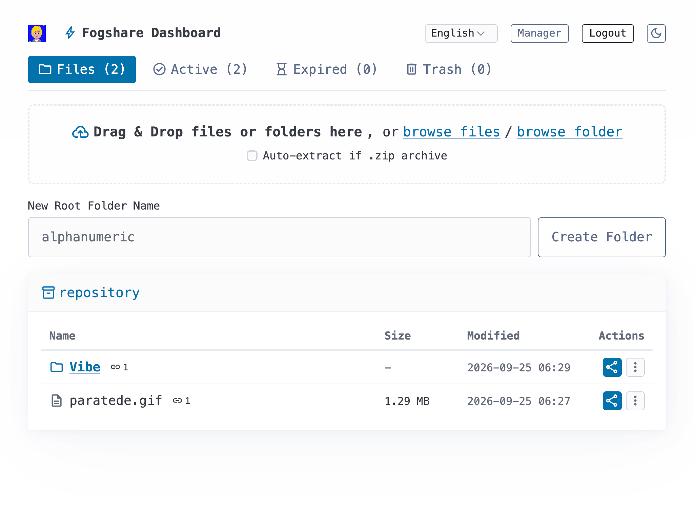
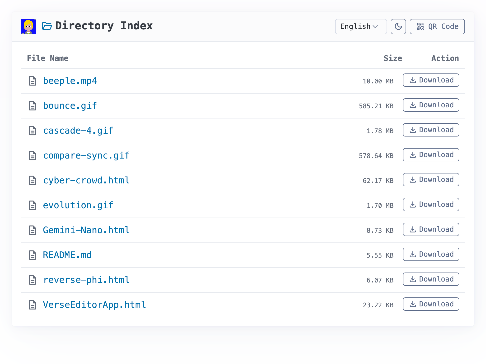
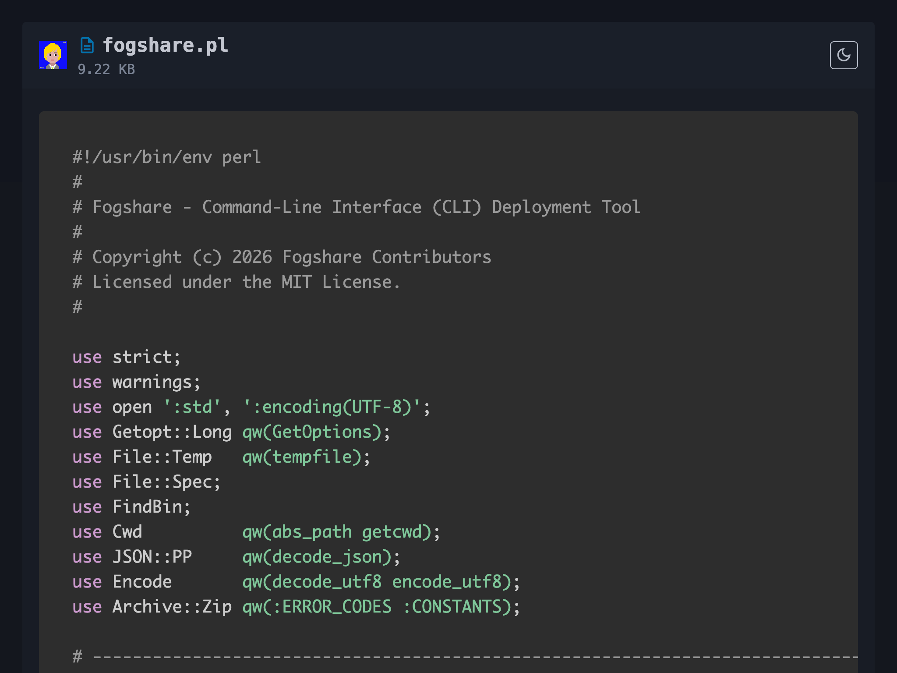

# Fogshare Documentation

## 1. Project Overview

Fogshare is a minimalist, self-hosted file distribution and web showcase engine. It combines modern fog computing edge-lightweight principles with a straightforward sharing experience similar to macOS Sharing. Fogshare supports generating short URLs (such as `https://domain.com/$slug` or `https://$slug.domain.com`) primarily for single-file distribution, static demo hosting (HTML/SPA), centralized shared library reuse, and protected sharing with passwords and burn-after-reading quotas.

## Screenshots

| Active Shares Management | Repository & Storage |
| :---: | :---: |
|  |  |

| Directory Indexing | Code & Markdown Showcase |
| :---: | :---: |
|  |  |

## 2. Key Features

1. **Single File & Static Site Hosting**: Native support for downloading and previewing files such as `.pdf`, `.md`, `.zip`, and `.tar.gz`; HTML files are served directly as web pages, with native support for shared library reuse (via `/_internal_files/` and `/_internal_libs/`).

2. **SPA Routing Friendly**: When hosting single-page applications with client-side routing, missing asset requests automatically fall back gracefully to `200.html` or `index.html`.

3. **Flexible Access Modes**: Supports both Path mode (slug appended to the primary domain) and Subdomain mode (slug mapped via wildcard subdomains).

4. **Multi-language Localization (I18N)**: Built-in support for 8 languages (Simplified Chinese, Traditional Chinese, English, Japanese, Korean, German, French, and Spanish), automatically matching the visitor's browser locale with manual switching support.

5. **Security & Isolation Architecture**:

   - Dedicated Admin/API domain whitelist protection, blocking unauthorized access to management panels and sensitive endpoints.

   - Password protection and brute-force mitigation: Rate-limiting detection automatically bans and locks out high-frequency failed attempts.

   - Burn-After-Reading & Anti-Scraping: Supports access count limits while intelligently filtering social preview bots (Twitterbot, Slackbot, Telegram, etc.) and prefetch requests to prevent premature quota exhaustion.

   - Secure Extraction: Built-in ZIP compression ratio limits, entry count caps, and volume threshold guards to prevent ZIP bomb vulnerabilities.

6. **Automated Maintenance**: Built-in supervisor daemon protected by an exclusive file lock, aggregating analytics logs and purging expired shares without requiring external cron jobs.

## 3. Quick Deployment: Docker Compose (Recommended)

Recommended for VPS or containerized setups, featuring a multi-stage build, Nginx reverse proxy, Starman application server, and X-Accel static delivery acceleration.

### Step 1: Clone the repository

```bash
git clone https://github.com/fogshare/fogshare.git
cd fogshare
```

### Step 2: Start the service

```bash
docker compose up -d
```

### Step 3: Retrieve the generated administrator password

```bash
docker compose logs | grep -A 4 "Security Alert"
```

### Step 4: Persistence and Configuration

Data is automatically preserved inside the mounted `./data` directory. You can adjust domain and upload limits in `docker-compose.yml`:

* `HTTP_PORT`: Ingress port exposed by the container (default: `3642`)

* `APP_ADMIN_DOMAIN`: Dedicated domain for the administrative console (e.g., `admin.example.com`)

* `APP_SHARE_DOMAIN`: Primary domain for public file sharing (e.g., `example.com`)

* `APP_MAX_UPLOAD_MB`: Maximum allowed upload payload size in MB (default: `128`)

> **Note**: When using subdomain mode, ensure wildcard DNS (`*.example.com`) resolves to your server IP address.

## 4. Configuration Reference (`./data/fogshare.json`)

Upon first launch, a default configuration file is automatically created in the data directory with the following primary options:

* `link_mode`: Sharing mode, `"subdomain"` or `"path"` (default: `"subdomain"`)
≥
* `share_domain`: Primary domain for visitor access (default: `"localhost"`)

* `admin_domain`: Dedicated domain for admin and API endpoints (default: `"admin.localhost"`)

* `app_data_dir`: Root storage path for persistent data and uploads (default: `"./data"`)

* `max_upload_mb`: Upload size limit in MB (default: `128`)

* `max_unzip_mb`: Maximum unpacked archive size in MB (default: `512`)

* `max_zip_entries`: Maximum number of files allowed inside an archive (default: `10000`)

* `enable_x_accel`: Toggle Nginx X-Accel internal static offloading (`1` to enable, `0` to disable)

* `enable_https`: Prefix generated share links with `https://` scheme (`1` to enable, `0` to disable)

* `site_name`: Custom brand title (default: `"Fogshare"`)

* `logo_url`: Brand logo asset path (default: `"/logo.svg"`)

* `favicon_url`: Browser favicon asset path (default: `"/favicon.ico"`)

## 5. Command-Line Interface (`fogshare`)

The built-in command-line utility is located at `bin/fogshare`, allowing direct deployments to your Fogshare node from any terminal.

### Step 1: Configure Authentication

```bash
export FOGSHARE_HOST="https://admin.yourdomain.com"
export FOGSHARE_TOKEN="your_api_token"  # Generated or retrieved in the Admin Console
```

### Step 2: Publish Files and Directories

```bash
# Share a single file
./bin/fogshare document.pdf

# Share a frontend application/directory (automatically packaged, uploaded, and extracted)
./bin/fogshare ./my-dist/

# Specify custom slug, access password, and a 7-day expiration time
./bin/fogshare ./my-dist/ -s cute-slug -p 8888 -t 7d

# Burn-after-reading share (limited to 3 successful visits)
./bin/fogshare secret.zip -v 3 -n "Internal eyes only"
```

### Step 3: Inspection and Teardown

```bash
# List active shares
./bin/fogshare --list

# Delete and destroy a share immediately
./bin/fogshare --teardown cute-slug
```

## 6. License

This project is open-sourced under the MIT License.
