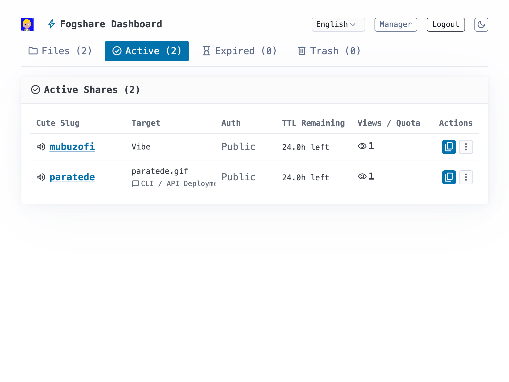
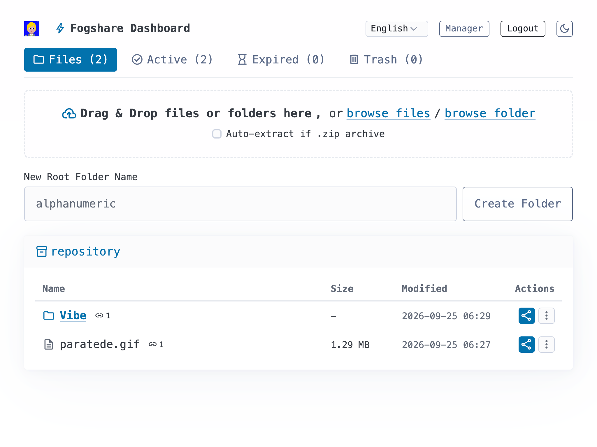
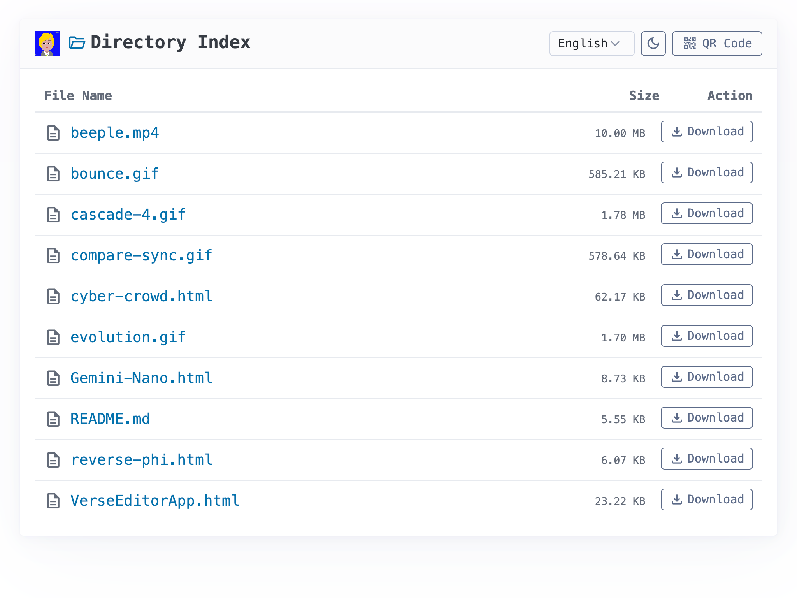
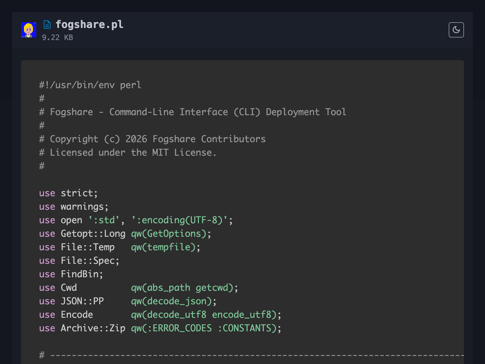

# Fogshare Documentation

## 1. Project Overview

Fogshare is a minimalist, self-hosted file distribution and web showcase engine. It combines modern fog computing edge-lightweight principles with a straightforward sharing experience similar to macOS Sharing. Fogshare supports generating short URLs (such as `https://domain.com/$slug` or `https://$slug.domain.com`) primarily for single-file distribution, static demo hosting (HTML/SPA), centralized shared library reuse, and protected sharing with passwords and burn-after-reading quotas.

## Screenshots

| Active Shares Management | Repository & Storage |
| :---: | :---: |
|  |  |

| Directory Indexing | Code & Markdown Showcase |
| :---: | :---: |
|  |  |

## 2. Key Features

1. **Single File & Static Site Hosting**: Native support for downloading and previewing files such as `.pdf`, `.md`, `.zip`, and `.tar.gz`; HTML files are served directly as web pages, with native support for shared library reuse (via `/_internal_files/` and `/_internal_libs/`).

2. **SPA Routing Friendly**: When hosting single-page applications with client-side routing, missing asset requests automatically fall back gracefully to `200.html` or `index.html`.

3. **Flexible Access Modes**: Supports both Path mode (slug appended to the primary domain) and Subdomain mode (slug mapped via wildcard subdomains).

4. **Multi-language Localization (I18N)**: Built-in support for 8 languages (English, Spanish, German, French, Simplified Chinese, Traditional Chinese, Japanese and Korean), automatically matching the visitor's browser locale with manual switching support.

5. **Security & Isolation Architecture**:

   - Dedicated Admin/API domain whitelist protection, blocking unauthorized access to management panels and sensitive endpoints.

   - Password protection and brute-force mitigation: Rate-limiting detection automatically bans and locks out high-frequency failed attempts.

   - Burn-After-Reading & Anti-Scraping: Supports access count limits while intelligently filtering social preview bots (Twitterbot, Slackbot, Telegram, etc.) and prefetch requests to prevent premature quota exhaustion.

   - Secure Extraction: Built-in ZIP compression ratio limits, entry count caps, and volume threshold guards to prevent ZIP bomb vulnerabilities.

6. **Automated Maintenance**: Built-in supervisor daemon protected by an exclusive file lock, aggregating analytics logs and purging expired shares without requiring external cron jobs.

## 3. Deployment Options

Fogshare provides three distinct deployment tiers tailored to different operational scopes:

### Tier 1: Quick Container Launch (Docker Compose)

Best for containerized environments and local testing. Features Nginx frontend offloading, Starman application server, and healthcheck probes.

```bash
git clone https://github.com/fogshare/fogshare.git
cd fogshare
docker compose up -d
```

* **Default Ingress Endpoints**:
  * Admin Console: `http://admin.localhost:3642/`
  * Public Portal: `http://localhost:3642/`


* **Retrieve Initial Admin Credentials**:
```bash
docker compose logs | grep -A 4 "Security Alert"
```
* **Volume & Ingress Customization**:
Persistent data is stored in the mounted `./data` directory. Ingress ports and domain mappings can be tuned via environment variables in `docker-compose.yml` (`HTTP_PORT`, `APP_ADMIN_DOMAIN`, `APP_SHARE_DOMAIN`, `APP_MAX_UPLOAD_MB`).

---

### Tier 2: Automated Bare-Metal Install (`curl | bash`)

Best for standard Linux VPS instances (Ubuntu/Debian, CentOS/RHEL/AlmaLinux, Alpine, FreeBSD) where an unattended, single-instance setup managed by Systemd and Nginx is preferred.

```bash
curl -fsSL https://github.com/fogshare/fogshare/raw/main/install.sh | sudo bash
```

* **Automated Workflow**:
1. Installs runtime dependencies (Perl, Starman, Cpanminus, Nginx).
2. Provisions a dedicated unprivileged `fogshare` service account.
3. Deploys application sources to `/opt/fogshare`.
4. Generates a local `.env` and renders the Nginx reverse-proxy configuration.
5. Configures, enables, and starts the Systemd service daemon (`fogshare.service`).


* **Service Verification & Logs**:
```bash
sudo systemctl status fogshare
sudo journalctl -u fogshare | grep -A 4 "Security Alert"
```

---

### Tier 3: Professional Non-Intrusive Assembly (`configure.sh`)

Best for advanced DevOps engineers and multi-tenant hosting. Supports complete directory decoupling, multi-domain isolation (e.g. `fog.lufeng.com`, `fog.lufeng.net`), zero-root configuration, and custom multi-tier proxy topologies.

#### 1. Clone into your target directory

```bash
git clone https://github.com/fogshare/fogshare.git /www/fogshare.example.com
cd /www/fogshare.example.com
```

#### 2. Run the CLI Configuration Generator

The non-intrusive `configure.sh` wizard parses CLI flags, validates host domains, generates an isolated `.env`, initializes storage layout, and renders a standalone Nginx virtual host without modifying system state:

```bash
# Custom production domain setup
./configure.sh \
  --admin-domain="fogshare.example.com" \
  --share-domain="example.com" \
  --backend-port=3647 \
  --http-port=80

# Fallback mode for local demonstration (admin.localhost / *.localhost)
./configure.sh
```

CLI Configuration Options:

* `-a, --admin-domain` : Dedicated domain for Admin UI & API (default: `admin.localhost`)
* `-s, --share-domain` : Base domain for public share subdomains (default: derived from admin domain)
* `-m, --link-mode`    : Routing mode: `subdomain` or `path` (default: `subdomain`)
* `-p, --backend-port` : Internal Starman listening port (default: `3647`)
* `-P, --http-port`    : Public Nginx ingress port (default: `80`)
* `-u, --max-upload`   : Maximum file upload limit in MB (default: `128`)
* `-d, --data-dir`     : Persistent data storage directory (default: `./data`)
* `-U, --user`         : Runtime user for filesystem permissions (default: `www-data`)

#### 3. Attach Nginx and Systemd Services

```bash

# Assign storage ownership

sudo chown -R www-data:www-data ./data

# Link and reload Nginx virtual host

sudo ln -sf "$(pwd)/fogshare.nginx.conf" /etc/nginx/sites-enabled/fogshare.example.com.conf
sudo nginx -t && sudo systemctl reload nginx

# Option A: Standalone single-instance service

sudo cp deploy/systemd/fogshare.service /etc/systemd/system/
sudo systemctl enable --now fogshare

# Option B: Multi-tenant isolated template (%I)

sudo cp deploy/systemd/fogshare@.service /etc/systemd/system/
sudo systemctl enable --now fogshare@fogshare.example.com
```

## 4. Configuration Reference (`./data/fogshare.json`)

Upon first launch, a default configuration file is automatically created in the data directory with the following primary options:

* `link_mode`: Sharing mode, `"subdomain"` or `"path"` (default: `"subdomain"`)
≥
* `share_domain`: Primary domain for visitor access (default: `"localhost"`)

* `admin_domain`: Dedicated domain for admin and API endpoints (default: `"admin.localhost"`)

* `app_data_dir`: Root storage path for persistent data and uploads (default: `"./data"`)

* `max_upload_mb`: Upload size limit in MB (default: `128`)

* `max_unzip_mb`: Maximum unpacked archive size in MB (default: `512`)

* `max_zip_entries`: Maximum number of files allowed inside an archive (default: `10000`)

* `enable_x_accel`: Toggle Nginx X-Accel internal static offloading (`1` to enable, `0` to disable)

* `enable_https`: Prefix generated share links with `https://` scheme (`1` to enable, `0` to disable)

* `site_name`: Custom brand title (default: `"Fogshare"`)

* `logo_url`: Brand logo asset path (default: `"/logo.svg"`)

* `favicon_url`: Browser favicon asset path (default: `"/favicon.ico"`)

## 5. Command-Line Interface (`fogshare`)

The built-in command-line utility is located at `bin/fogshare`, allowing direct deployments to your Fogshare node from any terminal.

### Step 1: Configure Authentication

```bash
export FOGSHARE_HOST="https://admin.yourdomain.com"
export FOGSHARE_TOKEN="your_api_token"  # Generated or retrieved in the Admin Console
```

### Step 2: Publish Files and Directories

```bash
# Share a single file
./bin/fogshare document.pdf

# Share a frontend application/directory (automatically packaged, uploaded, and extracted)
./bin/fogshare ./my-dist/

# Specify custom slug, access password, and a 7-day expiration time
./bin/fogshare ./my-dist/ -s cute-slug -p 8888 -t 7d

# Burn-after-reading share (limited to 3 successful visits)
./bin/fogshare secret.zip -v 3 -n "Internal eyes only"
```

### Step 3: Inspection and Teardown

```bash
# List active shares
./bin/fogshare --list

# Delete and destroy a share immediately
./bin/fogshare --teardown cute-slug
```

## 6. License

This project is open-sourced under the MIT License.
